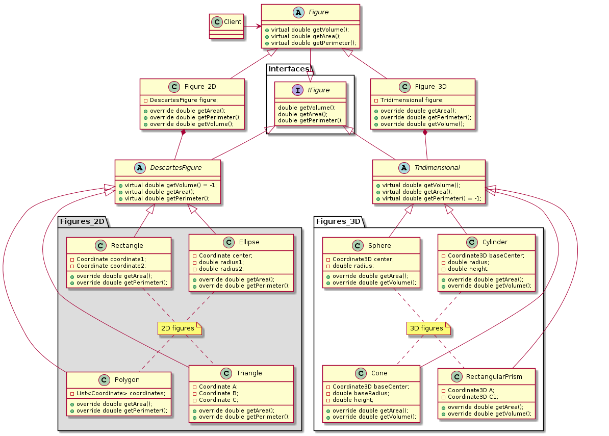
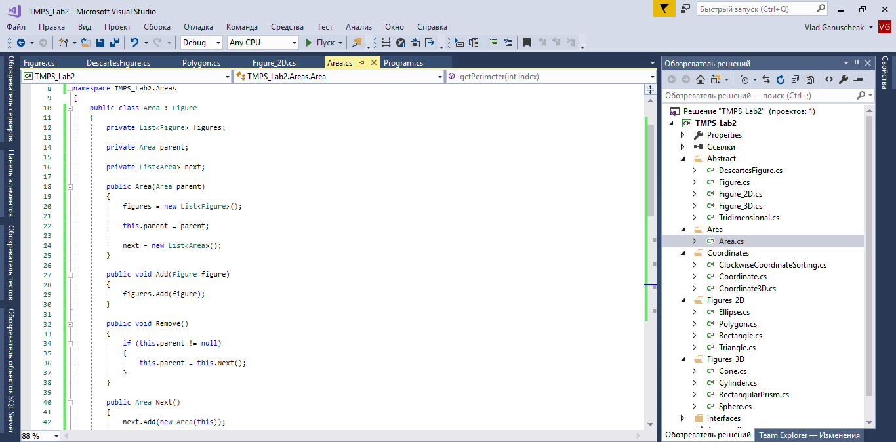

    

 
    
    
 Faculty of Computers, Informatics and 
 
    
Microelectronics 
 
    
 Technical University of Moldova

    

     
     
     
     
    
        
TMPS

        
Laboratory work #2

    

     
     
     
    
        
 Author: 

        
 Ganusceac Vlad 

         
        
 Supervisor: 

        
 Gavrilita Mihail 

    

     
     
     
    
 2019 

    
 Chişinau 

## Task 

To implement Structural design patterns as many as possible in a program. The structures should be linked between them and to work in composition.

***

## Implementation

My idea was to implement small API of Analytic Geometry. The main features of it were to find area, perimeter and volume of the figures. These figures may be 2D or 3D.

Thus, in order to do the code adaptive for refactoring I needed to implement the **Adapter** structural pattern.

In the image above:

* the _**Client**_ is those one who is doing action on the system. He/she collaborates with objects conforming to the Target interface.

* the _**Figure**_ is a target. It defines the domain-specific interface that Client uses;

* _**Figure_2D**_ and _**Figure_3D**_ are the adapters. They adapt the objects to _**IFigure**_ interface (extended by Figure);

* _**Rectangle**_ and _**Cone**_ are the objects which define an existing interfaces that need to be adapting.

***

But, unfortunatelly, the Adapter pattern is not enough for my case. I need to make it generic and the **Bridge** pattern corresponds perfectly to my task.

Now I'm able to manipulate with a long number of objects for each adapter. The trick was to use abstract class inside each adapter.

***

The third design pattern implemented by me was the **Composite** pattern. It would be nice to use the figures inside other (i.e. each figure may lie in the area of another one).

Thus I need to implement a tree structure. That's why I have choosed this pattern.

***

## Code

This is the structure of the program:

In the picture below is presented the code of the _**DescartesFigure**_ class:

It implements the methods of the _**IFigure**_ interface. They are virtual. That means that classes which inherit the current one may override corresponding methods.

***

This class overrides the methods of the previous one (with exception of the _**getVolume()**_ method, because 2D objects have nothing to do with volumes on descartes coordinate system).

As a result we may use such figures (using adapter) as _**Polygon**_:

As you can see, it implements only methods which are natural for its behaviour. It doesn't know nothing about _**getVolume()**_ method which requires the **IFigure** interface.

If we are speaking about 3D figures, we should mention that all of them have Area and Volume, but not all of them have Perimeter (Sphere or Ellipsoid, for example).

***

The class responsible for creation of N-dimensional trees. N may vary here, because de-facto the class contains the list of instances of itself.

***

The code executed on the Main() class.

During the execution the program gives the following results:

***

## Conclusion

Structural Design patterns offer us the possibility to create very flexibile and generic structures of objects which may have different nature and behaviour, but can communicate with each other through different abstract classes and interfaces.

In this laboratory work I have showed how different category elements (which have not much common between them) could be linked into one. These patterns help us to adapt and compose the data in a correct way!