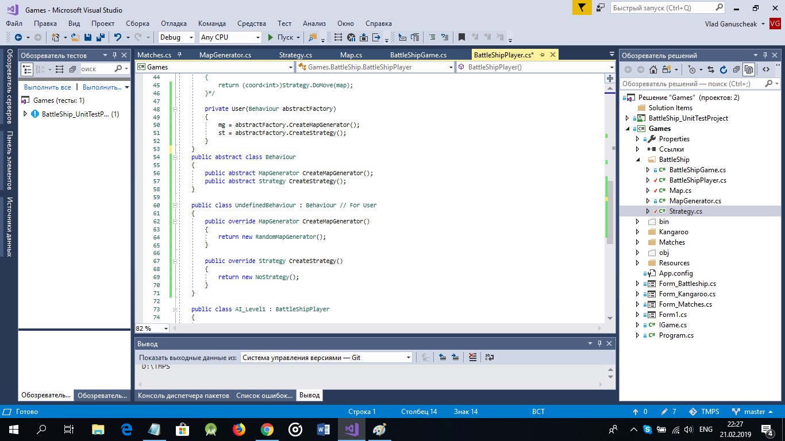
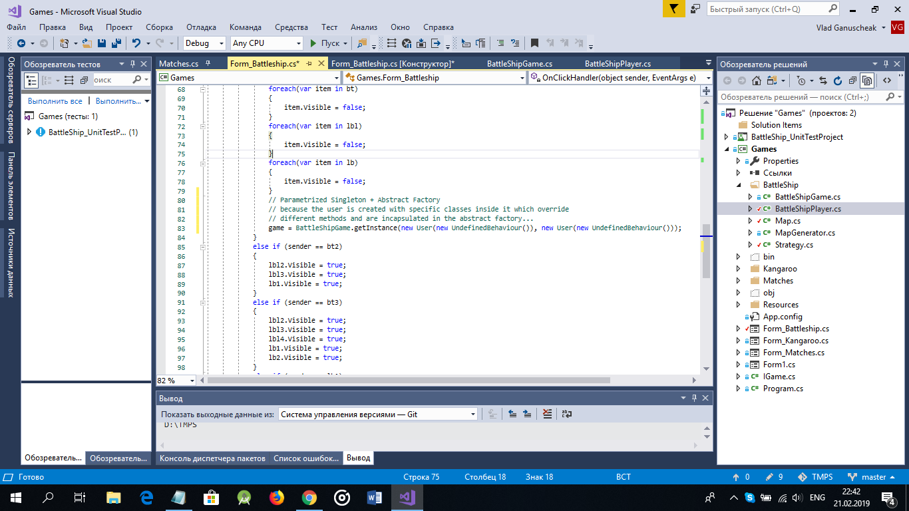

At the picture below is presented the Abstract Factory example. It has two abstract methods which should be overriden by the class which will inherit corresponding abstract class.

I have decided that the best idea is to set abstract factory directly in the constructor of a specific class. It's because inside this constructor I'll call corresponding methods and will create the objects what I really need in this context. It is very powerful instrument, because it gives the possibility to unite the methods into one abstract class and to create objects using corresponding methods. The main thing is that this methods create the objects which should cooperate in different tasks.

In the image below is ilustrated the example where is used parametrized Singleton method and it has two parametres where each of them (parametres) is BattleShipPlayer class which has its MapGenerator and Strategy (both united into an abstract class - abstract Factory).

I have to do more examples and functionalities for this theme, but I suppose that at least for this moment it is enough.