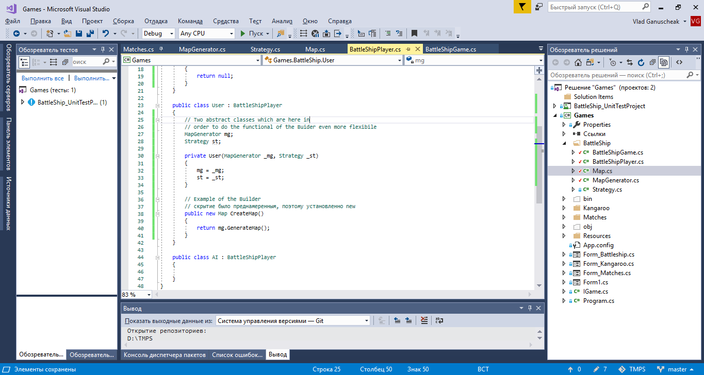
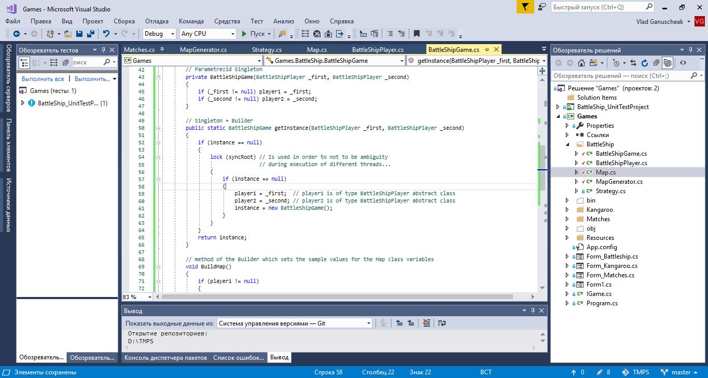

At the first picture there is User class (which inherits abstract class BattleShipPlayer class). In this class there are two fields:

* MapGenerator mg;
* Strategy st.

Both these fields are of abstract type and they are initialized directly in the constructor of the User class.

Having variable mg gives the possibility to generate different kind of maps. In order to do it, the User class has CreateMap() method which returns Map.

In the second example we can see the BattleShipGame class. It has two fields of type Map. Also it has two variables of type Abstract class BattleShipPlayer (such variables as player1, player2). 

What it gives us? It gives us the possibility to initialize the Map variables using the method CreateMap() of each BattleShipPlayer variable.

Usually the Builder pattern has Build() or Construct() method. My example has it, but with another name - CreateMap(), because I use it for Map construction (which is evidient from the name of the method).

Some aspects about how should be created Builder pattern I have found here: _https://metanit.com/sharp/patterns/2.5.php_