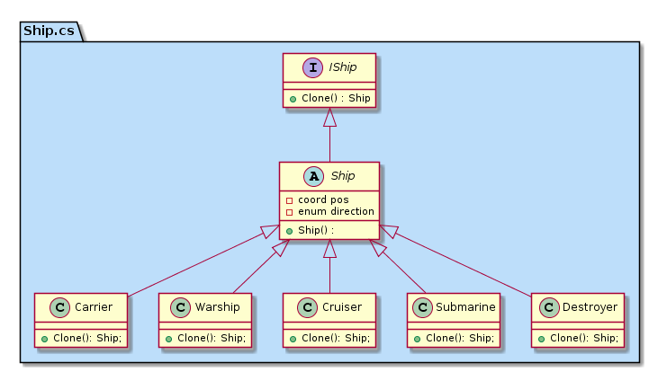
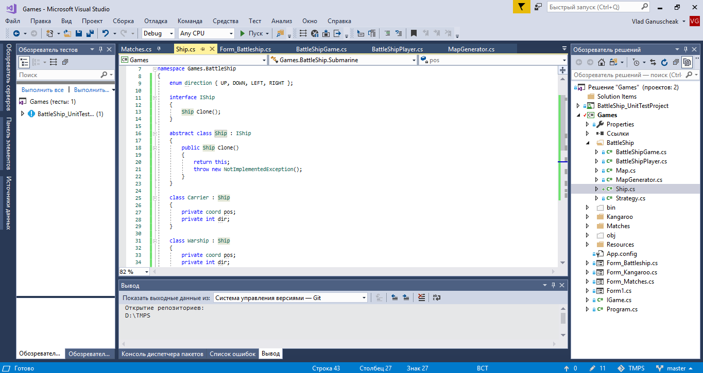

Battleship is a game where the warships may repeat as elements. It would be convinient to not to create every time each instance but to copy the existing one of the corresponding class.

Some of ships may appear one, two or more times on the map. The difference is the position and direction of each ship on the battlefield.

Below is ilustrated the example of how should be cloned the already existent objects. This is the prototype design pattern.

Only remains one question opened: what kind of copying should I provide: shallow or deep one. In order to have no any ambiguity, The abstract class _Ship_ inherits the interface _IShip_ and in _Clone()_ method returns its instance. Thus the 'deep' copying is provided by default. Isn't it flexible? 

In any moment in any class which inherits the abstract class mentioned above could be overriden the _Clone()_ method. Thus, the whole construction is flexible.

In all classes which extend the abstract one, I have indicated that they consist of initial coordinate and the direction. Also, probably, should add some properties as ship's size and some aspects linked with its graphical representation.