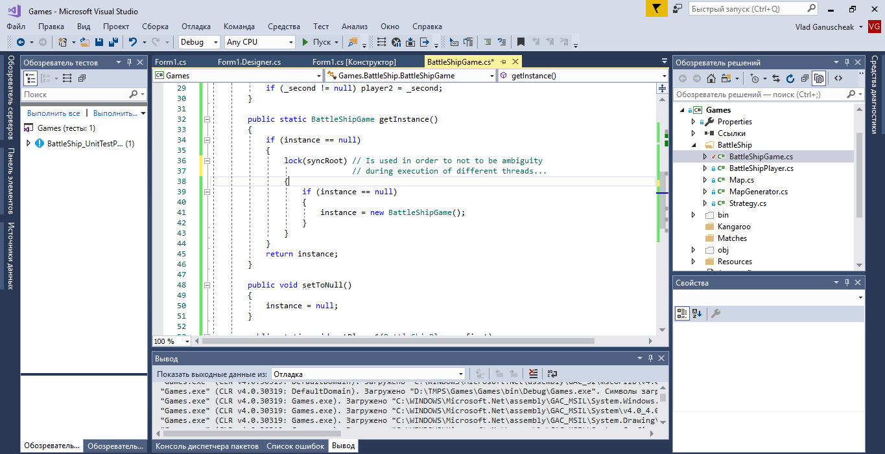
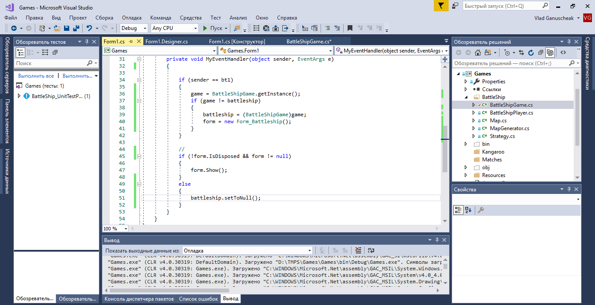
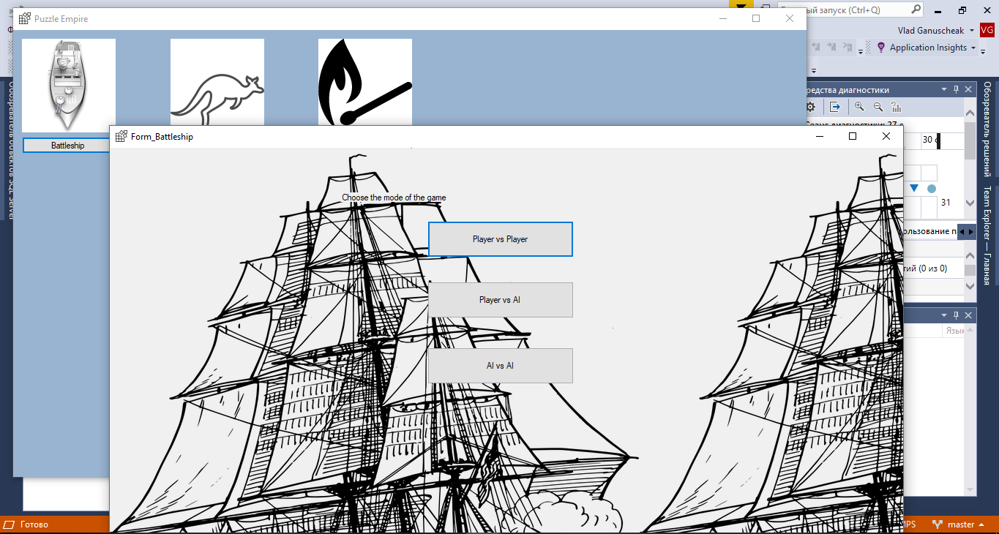

At this picture there is implementation of the _**getInstance()**_ method of the class which implements Singleton pattern. The _**instance**_ variable has _private static_ access modifiers and its constructor can't be accessed outside the class. The only one method to initialize this class (BattleShipGame in this example) is to call the getInstance() method. Initially the **instance** variable has _null_ value (i.e. isn't initialized). If it has null as a value, it will change its value. As a result, this method will return the instance value (after modifications or as it was uninitialized - null).

This picture shows only one class where the Singleton method has been implemented, but there are more classes in the project with similar implementation of the corresponding design pattern.

At this picture the _**game**_ variable is of type abstract class _Game_ and for it can be set the value of each object of class which inherits the corresponding abstract class.

If the first button (bt1) is pressed, we will try to check if the current value of the _**game**_ variable isn't equal to battleship object. If the statement is true, the _battleship_ variable will own new value (the value of _game_) and another one form will be created. Otherwise, nothing will happend. It means that during the Form of the application (here it is Form1) is opened, we can only open **only** anothe one Form.

At the picture bellow, I'm clicking at the button to create another one Battleship game, but only one form with corresponding game is available.

The interesting thing will happen, if I'll close the form of a game - the instance of the corresponding game still exists. That's why I've implemented the method _**setToNull()**_ which only will be executed when the Form is closed.

Here is another one example: from the Form1 I'm able to open many forms, but I can't open more than one form of the concrete game. So, in this picture have been opened four forms and I'm trying to open also another form which is equivalent to opened one. As the result the form additional form didn't open. It is all because I use singleton pattern to all custom classes which objects can be ment on Form1 designer. 

 [The refference of some inetialization details](https://metanit.com/sharp/patterns/2.3.php) may be founded at the METANIT.com site. I've choosed the classic form of the Singleton class initialization, but with check option of the multithreading, because, otherwise it could lead to an unexpected behaviour!